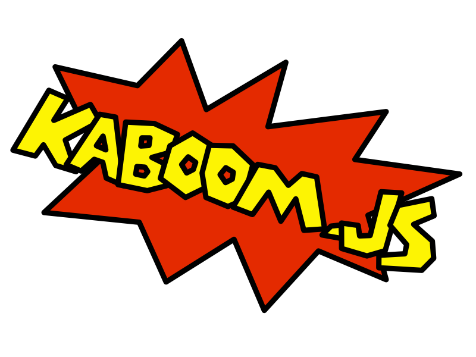

# Kaboom



[**Kaboom**](https://kaboomjs.com) is a JavaScript library that helps you make games fast and fun!

Start playing around with it in the [Kaboom Playground](https://kaboomjs.com/play)

## Examples

```js
// initialize context
kaboom()

// define gravity
setGravity(2400)

// load a sprite called "bean"
loadSprite("bean", "sprites/bean.png")

// compose the player game object from multiple components and add it to the game
const bean = add([
    sprite("bean"),
    pos(80, 40),
    area(),
    body(),
])

// press space to jump
onKeyPress("space", () => {
    // this method is provided by the "body" component above
    bean.jump()
})
```

Kaboom uses a powerful component system to compose game objects and behaviors.

```js
// add a game obj to the scene from a list of component
const player = add([
    // it renders as a sprite
    sprite("bean"),
    // it has a position
    pos(100, 200),
    // it has a collider
    area(),
    // it is a physical body which will respond to physics
    body(),
    // it has 8 of health
    health(8),
    // or give it tags for easier group behaviors
    "player",
    "friendly",
    // plain objects fields are directly assigned to the game obj
    {
        dir: vec2(-1, 0),
        dead: false,
        speed: 240,
    },
])
```

Blocky imperative syntax for describing behaviors

```js
// .onCollide() comes from "area" component
player.onCollide("enemy", () => {
    // .hurt() comes from "health" component
    player.hurt(1)
})

// check fall death
player.onUpdate(() => {
    if (player.pos.y >= height()) {
        destroy(player)
        gameOver()
    }
})

// if 'player' onCollide with any object with tag "enemy", run the callback
player.onCollide("enemy", () => {
    player.hp -= 1
})

// all objects with tag "enemy" will move towards 'player' every frame
onUpdate("enemy", (e) => {
    e.move(player.pos.sub(e.pos).unit().scale(e.speed))
})

// move up 100 pixels per second every frame when "w" key is held down
onKeyDown("w", () => {
    player.move(0, 100)
})
```

## Usage

### Start a Project With `create-kaboom`

The fastest way to start a Kaboom game is with [`create-kaboom`](https://github.com/replit/kaboom/tree/master/pkgs/create)

```sh
$ npm init kaboom mygame
```

This will create a directory called `mygame` for you, containing all the files we need

```sh
$ cd mygame
$ npm run dev
```

Then open http://localhost:5173 and edit `src/game.js`

### Install as NPM Package

```sh
$ npm install kaboom
```

```js
import kaboom from "kaboom"

kaboom()

add([
    text("oh hi"),
    pos(80, 40),
])
```

also works with CommonJS

```js
const kaboom = require("kaboom")
```

Note that you'll need to use a bundler like `esbuild` or `webpack` to use Kaboom with NPM

### Browser CDN

This exports a global `kaboom` function

```html
<script src="https://unpkg.com/kaboom@3000.0.1/dist/kaboom.js"></script>
<script>
kaboom()
</script>
```

or use with es modules

```html
<script type="module">
import kaboom from "https://unpkg.com/kaboom@3000.0.1/dist/kaboom.mjs"
kaboom()
</script>
```

works all CDNs that supports NPM packages, e.g. jsdelivr, skypack

## Documentation
- **v3000**: https://kaboomjs.com/
- **v2000**: https://2000.kaboomjs.com/
- **v0.5.0**: https://legacy.kaboomjs.com/


## Dev

1. `npm install` to install dev packages
1. `npm run dev` to start dev server
1. go to http://localhost:8000/ and pick an example
1. edit examples in `examples/` to test

Check out [CONTRIBUTION.md](CONTRIBUTING.md) for full info.

## Community

- [Discord Server](https://discord.gg/aQ6RuQm3TF)
- [GitHub Discussions](https://github.com/replit/kaboom/discussions)
- [Twitter](https://twitter.com/Kaboomjs)

### Games
Collection of games made with Kaboom, selected by Kaboom, [here](https://itch.io/c/2645141/made-in-kaboom).

- [on Itch.io](https://itch.io/games/tag-kaboomjs)
- [on Replit](https://replit.com/apps/kaboom)
- [on Newgrounds](https://www.newgrounds.com/search/conduct/games?tags=kaboomjs)

## Misc

- Thanks to [LaJBel](https://lajbel.repl.co/) for help building the Kaboom community
- Thanks to [abrudz](https://github.com/abrudz) for the amazing [APL386 font](https://abrudz.github.io/APL386/)
- Thanks to [Polyducks](http://polyducks.co.uk/) for the amazing [kitchen sink font](https://polyducks.itch.io/kitchen-sink-textmode-font) font
- Thanks to [0x72](https://0x72.itch.io/) for the amazing [Dungeon Tileset](https://0x72.itch.io/dungeontileset-ii)
- Thanks to [Kenney](https://kenney.nl/) for the amazing [1-Bit Platformer Pack](https://kenney.nl/assets/1-bit-platformer-pack)
- Thanks to [mulfok](https://twitter.com/MulfoK) for the amazing [mulfok32](https://lospec.com/palette-list/mulfok32) color palette
- Find bitmap fonts: [Oldschool PC Font](https://int10h.org/oldschool-pc-fonts)
- Featured on [Console 50](https://console.substack.com/p/console-50)
- Thanks to [Umayr](https://github.com/umayr) for kindly offering the "kaboom" npm package name
- Please buy fireworks on [kaboom.com](http://www.kaboom.com/)
- [How to do a KABOOM on a Trampoline](https://www.youtube.com/watch?v=3CemcWdc_Hc)
