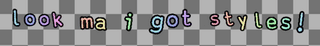
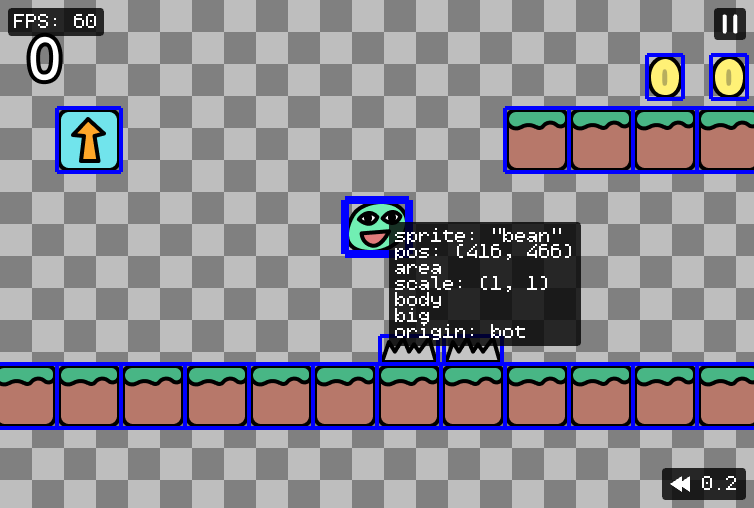

# 2000.1.0

> tga, 11/04/2021

## Record mode

Press F6 (in debug mode) to start recording a video! Press again to download (or use `record()` API to manually record).

Go to a random [demo](https://kaboomjs.com/play?demo=platformer) and try pressing F6!

(also added F5 to take a single screenshot)

## Text Transformations

A way to unlock possibilities for stylizing text: `transform` option on `text()` component and `drawText()`

```js
add([
    text("look ma i got styles!", {
        // runs this function against each character during render and apply the style returned
        transform: (idx, ch) => ({
            color: hsl2rgb((time() * 0.2 + idx * 0.1) % 1, 0.7, 0.8),
            pos: vec2(0, wave(-4, 4, time() * 4 + idx * 0.5)),
            scale: wave(1, 1.2, time() * 3 + idx * 0.5),
            angle: wave(-9, 9, time() * 3 + idx * 0.5),
        }),
    }),
])
```

this yields



Play around with this in the [text demo](https://kaboomjs.com/play?demo=text).

## Opaque Events

Some kaboom components triggers events that you can listen to, like

```js
// from body()
player.on("ground", () => player.stun(1))
// from sprite()
player.on("animEnd", () => destroy(player))
```

But the truth is you probably never heard about them, because they're no where on the documentation! Now we expose all events as functions like

```js
// from body()
player.onGround(() => player.stun(1))
// from sprite()
player.onAnimEnd("hit", () => destroy(player))
```

So you'll get proper documentation like all other functions, and type / jsdoc support.

## Toward Better API Consistency

Function names should effectly imply what they do and how they work. So far we're not doing well on this and a lot of the function names are causing confusion. It's time to pay the debt and start making improvements.

Here's the current ideal Kaboom naming scheme:

- `loadXXX()` for loading assets. They take a name as the first argument, and return a Promise that resolves when the loading is complete.
- `onXXX()` for registering event listeners. They receive a callback function as the last argument that gets called when the specific events get triggered, and return a function to cancel the event listener.
- `drawXXX()` for drawing. They'll take a single table argument containing all the drawing property.
- `testXXX()` for collision detection between 2 shapes.
- `addXXX()` for adding stuff. They wrap `add()` with some existing configuration of components and return the added game object(s).
- `setXXX()` for setting state.
- `getXXX()` for getting state.
- `isXXX()` for getting boolean state.

In this release, we cleaned up the event register functions and boolean getter functions and added versions with `on` or `is` prefixes as the preferred style, e.g.

- `onKeyPress()`
- `onCollide()`
- `onClick()`
- `onGround()`
- `onUpdate()`
- `isKeyDown()`
- `isGrounded()`

(full list on [CHANGELOG.md](https://github.com/replit/kaboom/blob/master/CHANGELOG.md#v200010-record-mode))

There's also the long confusion between words `action` and `update`, `render` and `draw`. They do exactly the same things in kaboom, but we use one in some places the other in other places (e.g. in component definition you use `update` to define per-frame action, but `action` to define the same thing on a game object). We think it's too confusing to keep 2 names around, and decided to encourage people to only use the word `update` and `draw`.

```js
// Register an event that runs every frame
player.onUpdate(() => {
    debug.log("hi from every frame")
})
```

Another benefit of making all event registers to start with `on` is: You're never supposed to nest an event register inside another one. E.g. You should never do this:

```js
// big nono! registering a collide event every frame will blow up your system
obj.action(() => {
    obj.collides("enemy", handleHit)
})
```

But now where every event register function starts with `on`, we can conveniently say: "You should never put a function starts with `on` inside another function starts with `on`." Nice and easy.

The old functions will still work and not affected at all until the next major version release, but it's recommended to embrace the new style!

## Component for State Machine

We added a `state()` component that help you better program behaviors with the finite state machine modal.

For example, here's how you might program a simple enemy AI, rotating between `"idle"`, `"attack"`, and `"move"` 3 states.

```js
const enemy = add([
    pos(80, 100),
    sprite("robot"),
    // define initial state and all available states
    state("idle", ["idle", "attack", "move"]),
]);

// this callback will run once when enters "attack" state
enemy.onStateEnter("attack", () => {
    // enter "idle" state when the attack animation ends
    enemy.play("attackAnim", {
        // any additional arguments will be passed into the onStateEnter() callback
        onEnd: () => enemy.enterState("idle", rand(1, 3)),
    })
    checkHit(enemy, player)
})

// this will run once when enters "idle" state
enemy.onStateEnter("idle", (time) => {
    enemy.play("idleAnim")
    wait(time, () => enemy.enterState("move"))
})

// this will run every frame when current state is "move"
enemy.onStateUpdate("move", () => {
    enemy.follow(player);
    if (enemy.pos.dist(player.pos) < 16) {
        enemy.enterState("attack")
    }
})
```

## Mouse Buttons

Now we support checking individual mouse buttons like the right / middle mouse,

```js
onMousePress("right", openMyContextMenu)
```

## Debug Mode UI

Now there's UI indicator for `debug.paused` (`F8`) and `debug.timeScale` (`F7`, `F9`), also adjusted the inspect mode UI to make stuff a bit more consistent.



## Better Demos

We've reworked our demo roster to be more educational. If you're new to Kaboom or you want to consolidate your knowledge, try go through the new demo list on [Kaboom Playground](https://kaboomjs.com/play) from the top!

### Other Changes

- Added `hsl2rgb()` to convert color in HSL to kaboom-compatible RGB
- Added support for multiple tags in `get()` and `every()`
- Fixed `onHover()` only works when mouse is pressed on certain devices
- Added some color constants `WHITE`, `BLACK`, `BLUE`, `GREEN`, `RED`, `MAGENTA`, `CYAN`, `YELLOW`
