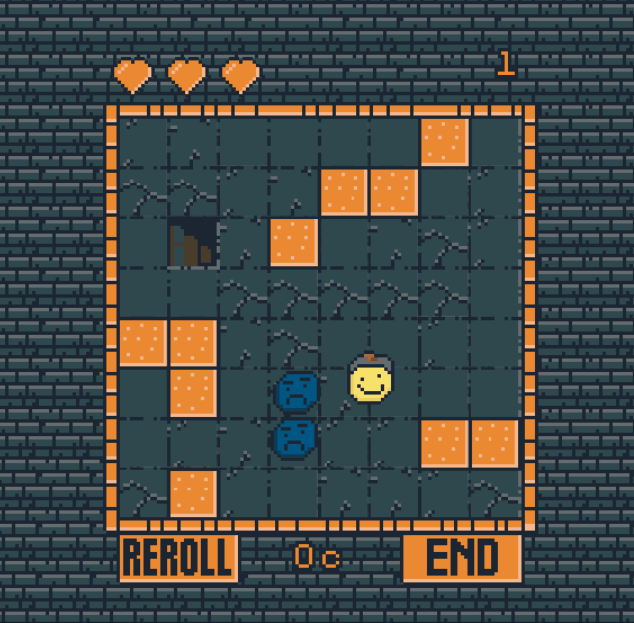
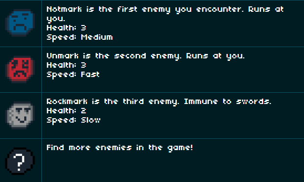
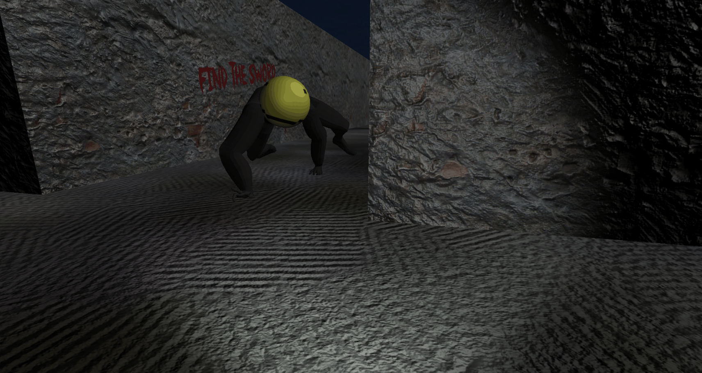

# MarkJam 4 Winners
> MarkJam 4 judges, 9/16/2022

MarkJam 4 has just finished! And we want to close it with the winners, this time we have had the total of...

**2** entries

Apparently not many were able to finish their game, I take this opportunity to say that in case you need to publish a game out of time (while judging period) you can always dm me to lajbel#3662 on Discord

So, showcase time! let's take a look at the two winners of this edition

## Classic, dungeon, random
> ErikoX, Mark's Knight

In a classic rogue like style, this game is about going down dungeons and defeating Mark based enemies, with a sword and using bombs.

Different types of enemies will accompany us on our adventures through the dungeons. With a excellent
graphic apart

By getting coins, you can also get upgrades and become a better knight, get the highest score!

> danie, I love it, specially, the art, great rogue-lite dungeon game!

> tga, This looks amazing and has lots of potential! Kinda hope there's some roguelike elements like choose upgrade each floor

## Horror, a strange monster
> Shrek2374, Afraid of the Mark

In this game we have the clear task of escaping from a dark
Mark that will chase us through a maze, where our goal is to find a sword to kill him.

> danie, scary scary scary scary.

> tga, mark is very cute in this game

Because of the immersive terror, it really cost our judges to rate this game (Especially Danie, who is very scary).

# Conclussion
Everyone is a winner! Hacker codes will be delivered soon :D. Thanks to the participants and to all the kaboomies who participated in this event, wait for the next one!

Happy burp, Kaboom.
