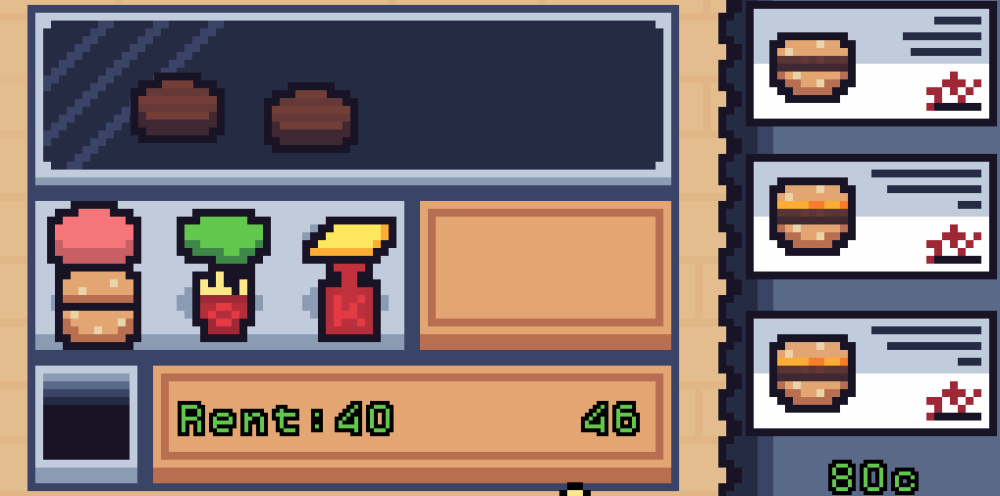
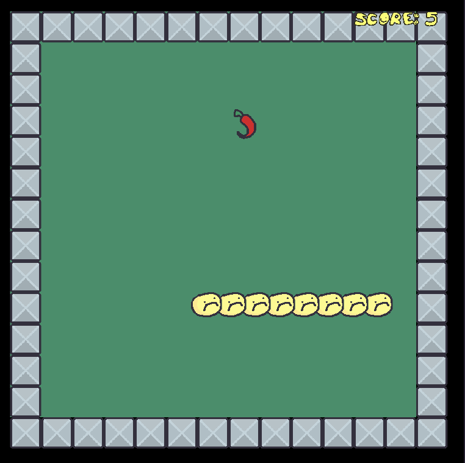
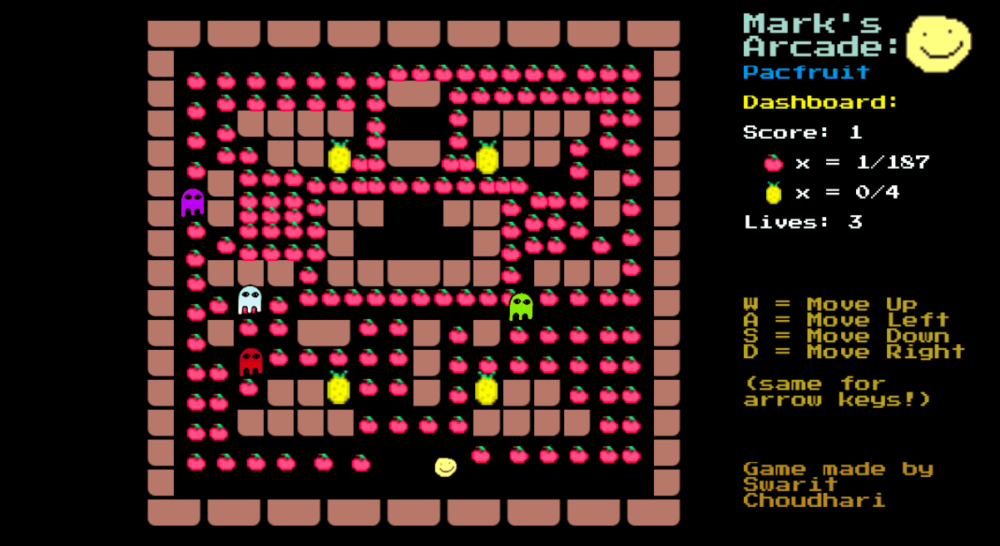

# MarkJam #5 winners
> Hungry Judges, 11/16/2022

MarkJam 5 was great, with so much participants, with so much submissions! Very cool games, now it's time to see the winners! The theme **"eat"** was selected, with a total of 14 entries!

## Winners

🥁🥁🥁🥁🥁🥁🥁
🥁🥁🥁🥁🥁🥁🥁

### GoldMark: [Marks Food Place](https://erikoxdev.itch.io/marks-food-place) by ErikoX
A cooking game with a very good graphic apart. We can live the real experiencie of work in a restaurant cooking food.

### SilverMark: [Snaked!](https://kenneyher.itch.io/snaked) by Kenney & andy007
A snake game but with a Mark spices, pretty good graphics and sounds! And the best, after eat, burps.

### BronzeMark: [Mark's Arcade: Pacfruit](https://swaritchoudhari.itch.io/pacfruit) by swaritchoudhariweb

A game (it must be said) about eat fruits in a maze, like Pacmark (or it was pacman?), very cool and with nostalgic art!

## Trophies
Here the MarkTrophies for our winners!

