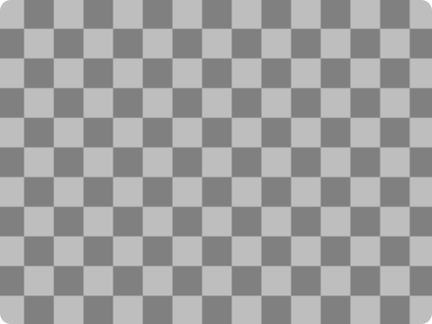

# Adding a game object with Kaboom.js

Kaboom is a fun library to use for creating simple games.

In Kaboom, all the elements we add to the game – such as players, bullets, rocks, clouds, text, and so on – are called "game objects".

In this tutorial, we'll show you how to add game objects (also known as sprites) to a game.

We'll be using boilerplate code, which is like a template, that you can use for starting most games created with Kaboom. You can find the code [in our repl](https://replit.com/@ritza/add-sprite-tutorial), and we'll explain it in detail here to help you form a good foundation for game development in Kaboom.

## Understanding the code

First, we need to import the Kaboom library and initialize the context with the `kaboom()` function. This creates a blank canvas with a nice checkerboard pattern, as shown in the image below. Any sprite we'll need for the game will be added to this checkerboard screen.

```js
import kaboom from "kaboom";

kaboom();
```



Here's the code to load a sprite to make it available in our game:

```js
loadSprite("bean", "sprites/bean.png");
```

Introducing Frog the "Bean"! A happy frog that enjoys life. You'll see Bean a lot around here.

Now we want to add Bean to the screen:

```js
add([
    sprite("bean"),
    pos(80, 40),
    area(),
    color(0, 0, 255),
]);
```

Here we use the `add()` function to add the game object to our canvas, and we can include multiple components to our function to give the object its different features, such as shape, position, color, collision area, and whether it should be subject to gravity.

Let's take a look at the components we used:

- `sprite()` - to render our sprite with the "Bean" graphic we loaded.
- `pos()` - to give Bean a position on our screen expressed as XY coordinates. In this case, Bean is placed at X=80 and Y=40.
- `area()` - to give Bean a collider area and enable collision detection.
- `color()` - to give Bean the color blue.

There are many more components you can use when you add game objects. Visit the [Kaboom.js website](https://kaboomjs.com/) to explore them.

## Things to try

Here are some you can try to extend this code:

- Add other components to Bean's character. Can you change Bean's shape?
- Play around with different sprites, positions, rotations, and scale.

You can try out the code in the embedded repl below:

<iframe height="400px" width="100%" src="https://replit.com/@ritza/add-sprite-tutorial?embed=true" scrolling="no" frameborder="no" allowtransparency="true" allowfullscreen="true" sandbox="allow-forms allow-pointer-lock allow-popups allow-same-origin allow-scripts allow-modals"></iframe>
