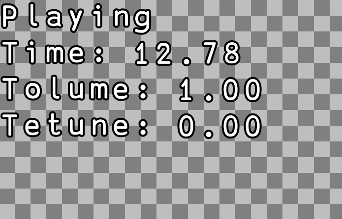

# Play an audio file with Kaboom

Kaboom is a fun library to use for creating simple games.

In this tutorial, we're going to learn how to create an audio control system that we can use to control audio playback, speed and volume. 

You can find the code we use at https://replit.com/@ritza/audio-system or check out the embedded code at the bottom of this tutorial.

## Steps to follow

The steps in the tutorial are as follows:

* Adding a variable to play audio on loop
* Adding text to display audio state and changes
* Adding audio control keys



## Getting started with the code

The first thing we're going to do is load the `kaboom()` library and initialize a Kaboom context.

```javascript
import kaboom from "kaboom";

kaboom()
```

Next, we'll load the audio or sound files that we want to play.

```javascript
loadSound("bell", "/sounds/bell.mp3")
loadSound("OtherworldlyFoe", "/sounds/OtherworldlyFoe.mp3")
```

## Loop Audio  

Now we're going to create a variable to keep playing one of our audio files on loop.

```javascript
const music = play("OtherworldlyFoe", {
    loop: true,
})
```

The `play()` function will keep playing our audio until we pause it, since we set the loop variable to "true" in the second parameter. We're going to set the initial volume for our audio to 0.5 using kaboom's `volume()` function.

```javascript
volume(0.5)
```

## Display audio state

Now we're going to create a `label` object to which we can add text to display the current state of our audio on the display window and also reflect the changes we make to it.

```javascript
const label = add([
    text(),
])
```

Next, we're going to create a `updateText()` function which will update our label object's `text()` function each time changes are made as well as update the timer as long as the audio is playing.

```javascript
function updateText() {
    label.text = `
${music.isPaused() ? "Paused" : "Playing"}
Time: ${music.time().toFixed(2)}
Tolume: ${music.volume().toFixed(2)}
Tetune: ${music.detune().toFixed(2)}
    `.trim()
}

updateText()
```

## Audio Control Keys

Now we're going to set up control keys and we'll start by using our keyboard's `space` key as the pause key.

```javascript
onKeyPress("space", () => {
    if (music.isPaused()) {
        music.play()
    } else {
        music.pause()
    }
})
```

Next, we'll use the up and down arrow keys to control the audio volume, and the left and right keys to control the audio's tune. 

```javascript
onKeyPress("up", () => music.volume(music.volume() + 0.1))
onKeyPress("down", () => music.volume(music.volume() - 0.1))
onKeyPress("left", () => music.detune(music.detune() - 100))
onKeyPress("right", () => music.detune(music.detune() + 100))
```

The escape key will be used to stop the music completely and reset the timer and changes made to the audio.

```javascript
onKeyPress("escape", () => music.stop())
```

Lastly, for the remaining audio file, we're going to use the second row of our QWERTY keyboard to create the "bell" sound, increasing the tune of the sound with each key as we move from left to right along the keyboard.

```javascript
const keyboard = "awsedftgyhujk"

for (let i = 0; i < keyboard.length; i++) {
    onKeyPress(keyboard[i], () => {
        play("bell", {
            // The original "bell" sound is F, -500 will make it C for the first key
            detune: i * 100 - 500,
        })
    })
}
```

## Things to try

You can follow https://kaboomjs.com/ to learn more about the Kaboom library.

Here are some suggestions you can try to enhance the game and challenge yourself:

* Create a disco background by changing the background color along with the timer.
* Add a dancing sprite

You can try out the code in the embedded repl below:

<iframe frameborder="0" width="100%" height="500px" src="https://replit.com/@ritza/audio-system?embed=true"></iframe>
