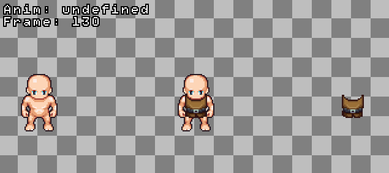

# Merging sprites with Kaboom

In this tutorial, we are going to learn how to merge two different sprite images into one. This could be useful for games in which you would like your player character to have some cool features, like an armory or new clothing.

## Steps to follow 

We'll cover the following:

* The merge function
* Adding sprites
* Adding animation

You can find the code we use in this tutorial [in our repl](https://replit.com/@ritza/sprite-merge), or try out the embedded repl at the end of this tutorial.



## Getting started with the code

The first thing we want to do is set up our game by loading the Kaboom library:

```javascript
import kaboom from "kaboom";
```

Before we initialize a Kaboom context, let's create a merge function for our sprites.

## Merge function

The `mergeImg()` function takes the URLs of the sprites we want to merge as an argument, and returns the merged image:

```javascript
function mergeImg(urls) {
    let promises = [];
    for (let url of urls) {
        const img = new Image();
        img.src = url;
        img.crossOrigin = "anonymous";
        promises.push(new Promise((resolve, reject) => {
            img.onload = () => {
                resolve(img);
            };
            img.onerror = () => {
                reject(`failed to load ${url}`);
            };
        }));
    }
    return new Promise((resolve, reject) => {
        Promise.all(promises).then((images) => {
            const canvas = document.createElement("canvas");

            const width = images[0].width;
            const height = images[0].height;
            canvas.width = width;
            canvas.height = height;
            const ctx = canvas.getContext("2d");
            if (ctx) {
                images.forEach((img, i) => {
                    if (img.width === width && img.height === height) {
                        ctx.drawImage(img, 0, 0);
                    }
                });
                resolve(ctx.getImageData(0, 0, width, height));
            } else {
                reject();
            }
        }).catch((error) => reject(error));
    })
}
```

## Setting up our game

Let's initialize a Kaboom context and set up the scale and font of our game:

```javascript
kaboom({
    scale: 2,
    font: "sinko",
})

```

Next we'll create an animation object `anims`, which will animate our sprites so they move in place:

```javascript
const anims = {
    x: 0, 
    y: 0, 
    height: 1344, 
    width: 832, 
    sliceX: 13, 
    sliceY: 21,
    anims: {
        'walk-up': {from: 104, to: 112}, 
        'walk-left': {from: 117, to: 125}, 
        'walk-down': {from: 130, to: 138}, 
        'walk-right': {from: 143, to: 151}, 
        'idle-up': {from: 104, to: 104}, 
        'idle-left': {from: 117, to: 117}, 
        'idle-down': {from: 130, to: 130}, 
        'idle-right': {from: 143, to: 143}, 
    }
}

```

We'll add three more objects to represent our sprites and the merged sprites. These objects will have the same animation properties we've provided for the 'anims' object:

```javascript
const playerAnims = {
    player: anims
};

const chestAnims = {
    chest: anims
};

const corpusAnims = {
    corpus: anims
};
```


## Adding sprites

Now let's load our sprites onto Kaboom. We'll load a sprite to each of the sprite objects `chestAnims` and `corpusAnims` we created:

```javascript
loadSpriteAtlas("/sprites/spritemerge_chest.png", chestAnims)
loadSpriteAtlas("/sprites/spritemerge_corpus.png", corpusAnims)
```

For the last object 'playerAnims', we'll merge the two other sprites into one using our function `mergeImg()`:

```javascript
mergeImg(["sprites/spritemerge_corpus.png", "/sprites/spritemerge_chest.png"]).then((img) =>
    loadSpriteAtlas(img, playerAnims)
);
```

Next we'll add some functionality to our objects to position them on the game screen:

```javascript

let DIRECTION = 'down';
gravity(0)

const player = add([
    sprite('player'),
    pos(center()),
    origin("center"),
    area(),
    body()
])


const corpus = add([
    sprite('corpus'),
    pos(center().add(-128, 0)),
    origin("center"),
    area(),
    body()
])


const chest = add([
    sprite('chest'),
    pos(center().add(128, 0)),
    origin("center"),
    area(),
    body()
])
```

- The `gravity()` function makes sure the objects will not be drawn to the edge of the screen.
- The `body()` component gives our objects a "body" that reacts to the game's gravity.
- The `area()` component makes our objects solid, so that no other objects can pass through them.
- We use `pos()` and `origin()` to provide our objects with an origin position each time the game is initiated.

## Adding animation

Now we can focus animating our sprites. We'll use the `play()` function provided by the `sprite()` component to display the specified animations:

```javascript
player.play("idle-down")
chest.play("idle-down")
corpus.play("idle-down")
```

Let's set up the direction keys on our keyboard to control the directional movement of our objects. We can implement this using the `switchAnimation()` function:

```javascript
onKeyDown('left', () => {
    DIRECTION = 'left';
    switchAnimation('walk');
})
onKeyDown('right', () => {
    DIRECTION = 'right';
    switchAnimation('walk');
})
onKeyDown('down', () => {
    DIRECTION = 'down';
    switchAnimation('walk');
})
onKeyDown('up', () => {
    DIRECTION = 'up';
    switchAnimation('walk');
})
onKeyRelease(['left', 'right', 'down', 'up'], () => {
    switchAnimation('idle');
})
```
Using a loop, we'll make it so that our game objects continue to move in the direction for which a key is pressed, else
they will stop moving, and 'switchAnimation' to 'idle'.

```javascript
function switchAnimation(type) {
    if (player.curAnim() !== type+'-'+DIRECTION) {
        player.play(type+'-'+DIRECTION, {loop: true});
        chest.play(type+'-'+DIRECTION, {loop: true});
        corpus.play(type+'-'+DIRECTION, {loop: true});
    }
}
```

Now we'll add some text to the screen to represent our objects' current state. We'll create the `getInfo()` function to hold the information about our objects' current animation, as well as the frame number of their current stance:

```javascript
const getInfo = () => `
Anim: ${player.curAnim()}
Frame: ${player.frame}
`.trim()
```

We'll use the `label` object to render `getInfo()` onto our screen. The `onUpdate()` function updates the text each time our objects change frames or direction:

```
const label = add([
    text(getInfo()),
    pos(4),
])

label.onUpdate(() => {
    label.text = getInfo()
})

```

## Things to try:

Here are some things you can try to enhance the game:

* Add more armory or clothing sprites to merge with the player.
* Add a platform and some levels to the game so the player has quests and can discover new armor in each level. 

You can also try out the repl below:

<iframe frameborder="0" width="100%" height="500px" src="https://replit.com/@ritza/sprite-merge?embed=true"></iframe>
