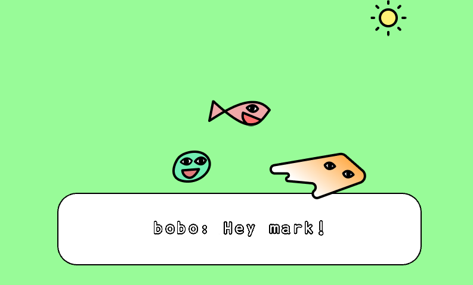

# Button sprite dialogs with Kaboom

In this tutorial, we'll show you how to create buttons and dialogs with objects in Kaboom.js.

When we're done, you should know how to:

* Give sprites button-like behavior
* Program sprites to talk to each other



You can find the code for this tutorial [on our repl](https://replit.com/@ritza/buttons-and-dialogs).

## Getting started with the code

Let's begin by initializing a kaboom context. Add the following lines of code:

```javascript
import kaboom from "kaboom"

kaboom({
	background: [152,251,152 ],
}
```

Here, we've used the `kaboom()` function to create a context with a pale green background color.

## Buttons

Next we'll create an object that behaves like a button. We'll add a "sun" sprite that displays a message when we click on it.

Add the following code to load the sprite into the context:

```javascript
loadSprite("sun", "/sprites/sun.png")
```

Now we create a sun object with the loaded sprite:

```javascript
const sunny = add([
	sprite("sun"),
	origin("center"),
	pos(center().sub(-250, 210)),
  area() 
])
```

The `area()` function allows us to use Kaboom's `onClick()` function to have our sun display a message when we click on it.

First we'll add a text box to show output when we click on the sprite:

```javascript

const textbox = add([
	rect(width() - 200, 120, { radius: 32 }),
	origin("center"),
	pos(center().x, height() - 100),
	outline(2),
])

const txt = add([
	text("", { size: 32, width: width() - 230 }),
	pos(textbox.pos),
	origin("center")
])
```

Now we can add our `onClick()` function to give the object button-like behavior:

```javascript
sunny.onClick(()=> txt.text="sunny: Burn losers!!")
```

If you run the program now and click on our sprite, you will see a message displayed in the textbox on the screen.

This is a pretty basic example of how to create an object that behaves like a button. For something a little more advanced, we could create a function to pass into the `onClick()` function that changes our object's behavior when the mouse moves over it.

Add the following line of code above `sunny.onClick()`:

```javascript
sunny.onUpdate(() => {
		if (sunny.isHovering()) {
			const t = time() * 10
			sunny.color = rgb(
				wave(0, 255, t),
				wave(0, 255, t + 2),
				wave(0, 255, t + 4),
			)
			sunny.scale = vec2(1.2)
		} else {
			sunny.scale = vec2(1)
			sunny.color = rgb()
		}
	})
```

Run the program now, and notice what happens when you hover the mouse over our sun object. You should see it transition between different colors in a wave-like motion. This `onHovering()` function comes in handy when you create multiple buttons and you want to see which is currently active before you click on it.

## Sprite dialogs

We can use these functions on multiple sprites. To demonstrate, let's create dialogs between several sprites using the `onClick()` function.

Add the following code below `loadSprite("sun", "/sprites/sun.png")`: to load the  "bean" and "goldfly" sprites into the context:

```javascript
loadSprite("bean", "/sprites/bean.png")
loadSprite("goldfly", "/sprites/goldfly.png")
```

This loads our "bean" and "goldfly" sprites into the context.

Next we create objects with these sprites:

```javascript
const bean = add([
	sprite("bean"),
	origin("center"),
	pos(center().sub(80, -50)),
  area(),
])

const goldy = add([
	sprite("goldfly"),
	origin("center"),
	pos(center().sub(-100, -80)),
  area(),
])
```

Let's add some dialogs for each sprite so they communicate each time we click on them:

```javascript
const beanSpeech = [ "Hello warm sunshine",  "Today is such a nice day, isn't it Goldy?", "The sun makes everything brighter", "Summer is the best season", "It should be summer all year round" ]

const goldySpeech = [
	 "It's so hot.", "How can you say that?!", "The sun is basically cooking us alive", "I don't think I can go on anymore,  I'm melting", "You got rifle? I think we can shoot it down"

goldy.onClick(()=> txt.text=goldySpeech[Math.floor(Math.random() * goldySpeech.length)])
bean.onClick(()=> txt.text=beanSpeech[Math.floor(Math.random() * beanSpeech.length)])

```

Run the program now, and you'll see that our two sprites "bean" and "goldy" interact when they are clicked on.

We can also use keyboard keys to make our sprites talk. Let's create two sprites that only communicate when we click on the space key.

Here's the code to load "bobo" and "mark" into the context:

```javascript
loadSprite("bobo", "/sprites/bobo.png")
loadSprite("mark", "/sprites/mark.png")

```

We need to create one array for the dialog between the two loaded sprites, and an object that will switch between the two sprites based on which one is currently talking.

```javascript
const dialogs = [
	[ "bobo", "Hey mark!" ],
	[ "mark", "what?" ],
	[ "bobo", "Isn't the sun nice and warm today?" ],
	[ "mark", "No" ],
	[ "bobo", "Come there's clear skies too, it's so pretty" ],
	[ "mark", "Aren't you a fish? Won't you die of dehydration." ],
	[ "bobo", "That's not the point!" ],
	[ "mark", "Uh huh?" ],
]

const avatar = add([
	sprite("bobo"),
	origin("center"),
	pos(center().sub(0, 50))
])
```

Let's program the "space" key on our keyboard to update the dialogs each time we press it:

``` javascript

let curDialog = 0

onKeyPress("space", () => {
	curDialog = (curDialog + 1) % dialogs.length
	updateDialog()
})
```

Now let's add an `updateDialog()` function to update our sprites each time we hit the space key:

```javascript
function updateDialog(curSprite) {

	const [ char, dialog ] = dialogs[curDialog]

	avatar.use(sprite(char))
	txt.text = char + ": " + dialog

}

updateDialog()
```

The `updateDialog()` function is responsible for switching or updating sprites in the `avatar` object we created. It also updates the dialog depending on which sprite is currenty the avatar, because we specified both the sprite and its speech in each element in the `dialogs` array.

Run the program now, and you'll see that each time you click on the space key, the sprites switch based on who is currently talking.

In this way, we can program any object to behave as a button. We can also use the `onKeyPress()` function to create control functions for an audio player or to control a player's movement, for example. This bevaiour isn't limited to on-screen button objects.

### Here are some things you can try out to challenge yourself:

* Create buttons to control a sprite's movement.
* Use keyboard keys to imitate piano keys.

You can find the code for this tutorial here:

<iframe frameborder="0" width="100%" height="500px" src="https://replit.com/@ritza/buttons-and-dialogs?embed=true"></iframe>
