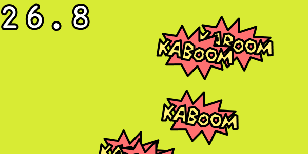

# Timing functions with Kaboom

In this tutorial, we'll show you how to create or add timers to your games so that you can time programs or functions to execute certain actions at a given time.

You can find the code for this tutorial [on our repl](https://replit.com/@ritza/timer-kaboom).



## Getting started

We'll start by initializing a Kaboom context for our program with the following code:

```javascript
kaboom({
  background: [216, 235, 52]
})
```

This code adds a nice yellow background to our context. 

Let's import the sprite we will be using in the tutorial:

```javascript
loadSprite("kaboom", "/sprites/kaboom.png")

```

That's it for the set up.

## Timing

There are various ways we can use timers in a Kaboom game: As a countdown or to measure how long we let our program run, or in function, to execute certain actions at a set time.

We'll start with a simple timer that runs for the same duration as the program.

Add the following code to your program:

```javascript
const label = add([
	text()
])

function updateText() {
	label.text = time().toFixed(1)
	
}
```

In the code above, we use the `label` variable to add our timer to the display screen as text. Kaboom's `time()` function provides the total time in the program since it began running as a number. The `toFixed()` variable converts our floating-point timer's values to strings, and rounds them to off to 1 decimal place. This way our time will increment every 10 milliseconds.

To make sure that our on-screen timer is updated each time it changes, we'll add the following two lines of code:

```javascript
updateText()
onUpdate(updateText)
```

If you run the program, you should see the timer running as soon as you start it. This is how you can add a timer to your programs.

Another way to use timing in kaboom is with the `loop()` or the `wait()` functions. In the `loop()` function, we pass the number of seconds we want to wait and the action we want to execute after that time has passed. With the `wait()` function, we can delay certain actions in the program and only execute them after a certain amount of time has passed.

```javascript
loadSprite("kaboom", "/sprites/kaboom.png")

loop(0.5, () => {

	const bean = add([
		sprite("kaboom"),
		pos(rand(vec2(0), vec2(width(), height()))),
    
	])

	wait(3, () => {
		destroy(bean)
	})

})
```

Here we use a `loop()` function to spawn a new bean sprite every 0.5 seconds, and we use the `wait()` function to destroy that bean after three seconds.

### Things to try

* Create a timer for a runner game that increases the game speed as the time increases.
* Create a timer to change the background colors of the game screen every five seconds while the program runs.

You can find the code for this tutorial here:

<iframe frameborder="0" width="100%" height="500px" src="https://replit.com/@ritza/timer-kaboom?embed=true"></iframe>
