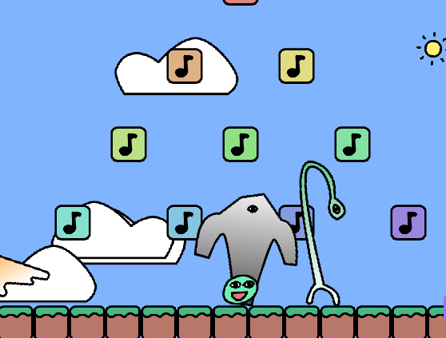

# Sprite concert with Kaboom

In this tutorial, we'll learn about several concepts from the Kaboom framework by creating an outdoor concert.

Some of the concepts we're going to learn about include:

* Adding audio
* Adding text on screen
* Moving camera positions
* Spawning game objects
* Animating sprites



You can find the code for this tutorial [on our repl](https://replit.com/@ritza/kaboom-concert).

## Concert  set up

To begin, let's initialize a Kaboom context by adding the following code to our program:

```javascript
kaboom({
	scale: 0.7,
	background: [ 128, 180, 255 ],
})
```

Here we create a nice sky-blue background for the context.

Let's import all the sprites and sounds we'll be using:

```javascript
loadSprite("bean", "/sprites/bean.png")
loadSprite("bag", "/sprites/bag.png")
loadSprite("bobo", "/sprites/bobo.png")
loadSprite("onion", "/sprites/onion.png")
loadSprite("ghosty", "/sprites/ghosty.png")
loadSprite("lamp", "/sprites/lamp.png")
loadSprite("goldfly", "/sprites/goldfly.png")
loadSprite("gigagantrum", "/sprites/gigagantrum.png")
loadSprite("note", "/sprites/note.png")
loadSprite("grass", "/sprites/grass.png")
loadSprite("cloud", "/sprites/cloud.png")
loadSprite("sun", "/sprites/sun.png")
loadSound("bell", "/sounds/bell.mp3")
loadSound("kaboom2000", "/sounds/kaboom2000.mp3")

```

We're going to declare a few constants for our concert. Add this code below the sprite imports:

```javascript
const FLOOR_HEIGHT = 64
const JUMP_FORCE = 1320
const CAPTION_SPEED = 340
const PLAYER_SPEED = 640

let started = false
let music = null
let burping = false

gravity(2400)

```

In the code above, we've declared the height of the platform our sprites will be working on, the jump force for our main "player" sprite, the movement speed of all the sprites, and the movement speed of our main player sprite.

The variables `started` and `burping` are boolean values that will be changed if a specific condition is met, causing a different event to take place. The `started` variable will check if the music is started, if not it will turn true and `music` will hold the sound and play it as the background music for the program.

Let's add a platform for our sprites to walk and land on. Add the following code to your program:

```javascript
for (let x = 0; x < width(); x += 64) {
	add([
		pos(x, height()),
		sprite("grass"),
		origin("botleft"),
		area(),
		solid(),
	])
}
```

Using the for loop above, we use the `"grass"` sprite to create a platform for the game. The parameters `let x = 0; x < width(); x += 64` let us keep adding a new grass sprite to the screen until we cover the entire width of the game screen, in which case `x` will be greater than the screen width.

We need to add our player sprite so that we can test some of the functionality as we implement our program. Add the following code below the previous for loop:

```javascript
const player = add([
	sprite("bean"),
	pos(width() / 2, height() - FLOOR_HEIGHT),
	area(),
	body(),
	origin("bot"),
	z(100),
])
```

The `area()` and `body()` functions let us give the player a physical body which can react to the gravity in the game.

## Party music

In this section, we'll go over how to use the sound clips we've imported from Kaboom at the beginning of the tutorial.

We're going to add different types of sound to the program. To make things interesting, let's use the "note" sprite to create rows of different sprites that play a different sound on collision with the player sprite.

Also, we want to program the notes such that, whenever our player sprite collides with one of them for the first time, background music begins to play for as long the program runs or until our player collides with the last note at the top.

Add the following code below the "bean" object:

```javascript

const gw = 200
const gh = 140
const maxRow = 4
const notes = [ 0, 2, 4, 5, 6, 7, 8, 9, 11, 12, ]
```

These constant variables define the number of `note` sprites we want in the game, the position of each sprite relative to the width and height of the game screen, and the maximum number of `note` sprites per row.

Add the following code below the variables:

```javascript
for (let i = 1; i <= maxRow; i++) {
	for (let j = 0; j < i; j++) {
		const n = i * (i - 1) / 2 + j
		const w = (i - 1) * gw + 64
		add([
			sprite("note"),
			pos(j * gw + (width() - w) / 2 + 32, height() - FLOOR_HEIGHT + 24 - (maxRow - i + 1) * gh),
			area(),
			solid(),
			origin("bot"),
			color(hsl2rgb((n * 20) / 255, 0.6, 0.7)),
			bounce(),
			scale(1),
			n === 0 ? "burp" : "note",
			{ detune: notes[9 - n] * 100 + -800, },
		])
	}
}
```

The code above will generate rows of `note` sprites. The `solid()` function makes sure that no other game object can pass through the notes. This line of code: `n === 0 ? "burp" : "note"` gives each sprite the name "note", unless it is the last note sprite, in which case it's given the name "burp".
  
The "bell" sound is the one we will be using for each note sprite. This line of code: `{ detune: notes[9 - n] * 100 + -800, }` will decrease the tone of sound with each note sprite we add.

Let's add a function to handle collisions between the player and the notes. Add the following below the for loops:

```javascript
function bounce() {
	let bouncing = false
	let timer = 0
	return {
		id: "bounce",
		require: [ "scale" ],
		update() {
			if (bouncing) {
				timer += dt() * 20
				const w = Math.sin(timer) * 0.1
				if (w < 0) {
					bouncing = false
					timer = 0
				} else {
					this.scale = vec2(1 + w)
				}
			}
		},
		bounce() {
			bouncing = true
		},
	}
}
```

Here our `bounce()` function will create a fun bouncing effect when the player collides with a note sprite. The `vec2()` function will increase the size of the note sprite and then return it to its original size, making it appear as if the sprite is bouncing without having to displace it.

Now for the actual sound, let's add the following code below the bounce function:

```javascript
player.onHeadbutt((block) => {
	if (block.is("note")) {
		play("bell", {
			detune: block.detune,
			volume: 0.1
		})
		addKaboom(block.pos)
		shake(1)
		block.bounce()
		if (!started) {
			started = true
			caption.hidden = false
			caption.paused = false
			music = play("kaboom2000")
		}
	} else if (block.is("burp")) {
		burp()
		shake(480)
		if (music) music.stop()
		burping = true
		player.paused = true
	}
})
```

We use the `onHeadButt()` function to register the collision between the player and any other solid game object. We pass it the name of the object our player collides with, and execute specific actions if it is a note sprite or our final "burp" sprite.

The first collision with a note sprite starts the background music playing, and all collisions with note sprites play the "bell" sound assigned to them.

Remember, the name of the last note sprite is "burp". This sprite will play a different sound when our player collides with it. We use an if-else statement in `onHeadButt()` function to specify the different behaviors of each sprite upon collision. While the note sprites will bounce and play a bell sound, the "burp" sprite will stop the music and end our concert and all other sprite activities.

## Karaoke text

Let's take a look at how to add text to the screen using the `text()` function. The text we'll use will be lyrics from the "kaboom2000" sound clip we imported.

Add the following code below the `onHeadButt()` function:

```javascript
const lyrics = "kaboom2000 is out today, i have to go and try it out now... oh it's so fun it's so fun it's so fun...... it's so fun it's so fun it's so fun!"

const caption = add([
	text(lyrics, {
		transform(idx, ch) {
			return {
				color: hsl2rgb(((time() * 60 + idx * 20) % 255) / 255, 0.7, 0.8),
				scale: wave(1, 1.2, time() * 3 + idx),
				angle: wave(-9, 9, time() * 3 + idx),
			}
		},
	}),
	pos(width(), 32),
	move(LEFT, CAPTION_SPEED),
])

caption.hidden = true
caption.paused = true
```

Here we create a variable to hold the lyrics of the background music. We use the `caption` object to display the lyrics across the screen when the sound starts to play.

The `transform()` function is used to glide the text across the screen. The `scale` and `angle` and attributes make use of the `wave()` function to animate the text as it moves across the screen. We use `hsl2rgb()` to add random colors to each letter in the text.

## Camera positioning

Another cool function to use in Kaboom is the `camPos()` function. Using this function, we can move the camera to focus on the player position. The `camScale()` can scale up on the player's position, creating a camera zoom-in effect. We'll add this function for when our "player" sprite collides with the "burp" sprite.


Add the following function below `caption.paused = true` variable:

```javascript
onUpdate(() => {
	if (!burping) return
	camPos(camPos().lerp(player.pos, dt() * 3))
	camScale(camScale().lerp(vec2(5), dt() * 3))
})

```

This function could be really handy when creating role-playing games, where you get to follow a player's movements and the camera shifts relative to where the player goes.

## Dance moves

Let's add some movement functionality for the "player" sprite. Add the following code below the previous `onUpdate()` function:

```javascript

function jump() {
	if (player.isGrounded()) {
		player.jump(JUMP_FORCE)
	}
}
```

In the code above, we create a `jump()` function for the "player" sprite, which checks that the player `isGrounded()` on a platform before making them jump. We pass the jumping force we declared at the beginning of the tutorial to the `jump()` function to specify how high the sprite can jump. We can use Kaboom's `jump()` function on our player object because we gave it a `body()` component when we added it.

Next, we'll implement the left and right movement using the keyboard left and right arrow keys, and the jumping movement using the space bar or up arrow key.

```javascript
onKeyPress(["space", "up"], jump)
onKeyDown("left", () => player.move(-PLAYER_SPEED, 0))
onKeyDown("right", () => player.move(PLAYER_SPEED, 0))
```

We declared the variable `PLAYER_SPEED` at the beginning of the tutorial, and it specifies how fast the "player" sprite can move along the horizontal axis on a platform.

## Add party members

Let's learn how to spawn game objects by making use of the timer functions.

Add the following code below the `onKeyPress` functions:

```javascript
const members = [
	"bag",
	"bobo",
	"onion",
	"ghosty",
	"lamp",
	"gigagantrum",
	"goldfly",
]
```

This is our guest list! We're going to create a function to spawn each of these sprites in the `members` list onto the game screen at different times.

Add the following code below the guest list:

```javascript
function spawnFriend() {

	const member = choose(members)
	const dir = choose([LEFT, RIGHT])

	add([
		sprite(member, { flipX: dir.eq(LEFT) }),
		move(dir, rand(120, 320)),
		cleanup(),
		pos(dir.eq(LEFT) ? width() : 0, height() - FLOOR_HEIGHT),
		area(),
		rotate(),
		funky(),
		origin("bot"),
		z(50),
	])

	wait(rand(1, 3), spawnFriend)

}
```

The function `spawnFriend()` above chooses a random sprite from our list of members and adds them in different locations. Initially, each sprite is facing towards the right. The line `sprite(member, { flipX: dir.eq(LEFT) })` flips the sprite to face left.

We use the timer function `wait()` to specify that our program should wait for a randomly chosen interval of between one and three seconds before adding a new friend.

Let's add some code to animate our sprites' movement:

```javascript
function funky() {
	let timer = 0
	return {
		id: "funky",
		require: [ "pos", "rotate", ],
		update() {
			timer += dt()
			this.angle = wave(-9, 9, timer * 4)
		},
	}
}

```

The `funky()` function adds a wavy animation to the sprites as they move to give them a funky walking a effect.

Let's create a spawn function for our clouds to add a little animation to the sky. Add the following function below the `spawnFriend()`:

```javascript
function spawnCloud() {

	const dir = choose([LEFT, RIGHT])

	add([
		sprite("cloud", { flipX: dir.eq(LEFT) }),
		move(dir, rand(20, 60)),
		cleanup(),
		pos(dir.eq(LEFT) ? width() : 0, rand(-20, 480)),
		origin("top"),
		area(),
		z(-50),
	])

	wait(rand(6, 12), spawnCloud)

}
```

This `spawn()` function spawns a random cloud from a different direction every six to twelve seconds. Let's call both these functions to execute the spawning. Add the following code below the functions:

```javascript

spawnCloud()
spawnFriend()
```

## The sun dance

Using the `wave()` function is one way of animating sprites. Another function we can use is `angle()`. Adding the `rotate()` component to an object lets us use `angle()` to rotate it at a specific angle at specific speeds.

Add the following code below the spawn function calls:

```javascript
const sun = add([
	sprite("sun"),
	origin("center"),
	pos(width() - 90, 90),
	rotate(),
	z(-100),
])

sun.onUpdate(() => {
	sun.angle += dt() * 12
})
```

In the line `sun.angle += dt() * 12` we set the "sun" sprite to rotate at a 12 degree angle infinitely.

That's it for our Kaboom concert. Run the program now to try out all the functionality we've implemented. To see the `camPos()` function in effect, make the "player" sprite collide with the last note.

### Things to try

Here are some ideas to try:

* Create an imitation *Mario* game and add the `camPos()` function to follow Mario as he moves across the screen.
* Create a karaoke machine with a list of songs a user can choose from to display the lyrics onscreen.

Try out the embedded repl below:

<iframe frameborder="0" width="100%" height="500px" src="https://replit.com/@ritza/kaboom-concert?embed=true"></iframe>
