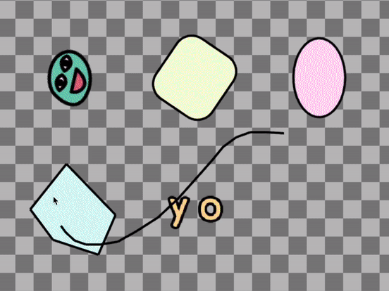
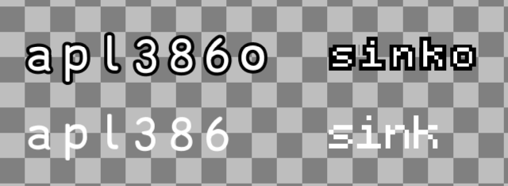
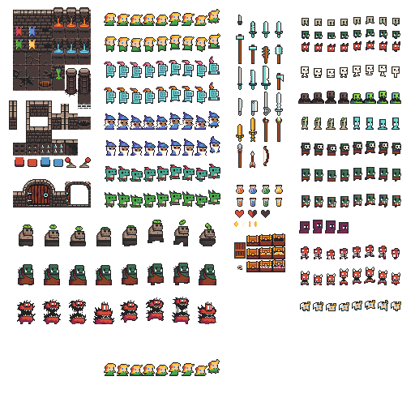
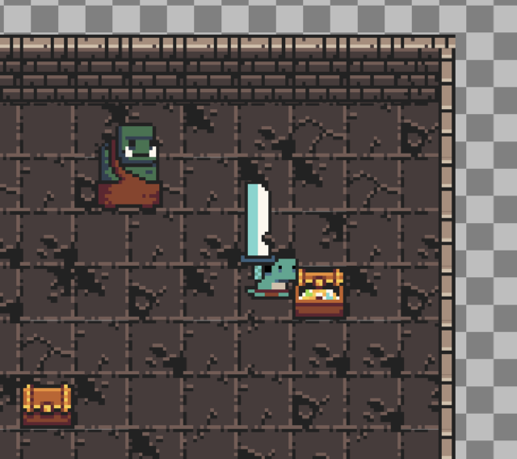
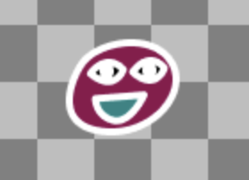

# kaboom2000

> tga, 10/20/2021

Kaboom has just released the first stable version, but v1.0.0 is lame, let's go straight to v2000.0.0. Before we go into the feature highlights, bean is holding a concert to celebrate kaboom2000! Join [here](/play?demo=concert).

<video controls width=640 src="/site/img/concert2000.mp4"></video>

## New Components

Bunch of new components to further help with composition. To name a few:

- `opacity()` to set opacity
- `health()` to manage health related logic
- `move()` to manage projectile-like behavior
- `cleanup()` to auto destroy obj when it leaves screen
- `outline()` to draw outline around whatever the shape is
- `timer()` to attach timers to a game obj
- `fixed()` to make a game obj unaffected by camera
- `stay()` to make a game obj stay after scene switch
- `lifespan()` to destroy game obj after certain amount of time
- `z()` to define draw order for objs on the same layer

## Graphics

Lots of new graphics features and performance improvements.



Added new drawing functions like

- `drawSprite()`
- `drawText()`
- `drawRect()`
- `drawLine()`
- `drawLines()`
- `drawCircle()`
- `drawEllipse()`
- `drawTriangle()`
- `drawPolygon()`
- `drawUVQuad()`

and transformation-related functions like

- `pushTransform()`
- `popTransform()`
- `pushTranslate()`
- `pushScale()`
- `pushRotate()`

These are not tied to any component system (in fact components like `sprite()`, `rect()` and `circle()` are just thin wrappers around these), and should be called in a per-frame basis. For example

```js
// the callback in render() gets run every frame
render(() => {
	drawSprite({
		sprite: "froggy",
		pos: vec2(120, 160),
	});
	drawCircle({
		sprite: "froggy",
		pos: mousePos(),
	});
});
```

For more check out [this demo](https://kaboomjs.com/play?demo=draw)

## Color and Rotation Units

Normalized RGBA and radians confuse some beginners. Kaboom changed to use 0-255 RGB colors and degrees

```js
add([
	rect(60, 40),
	pos(120, 120),
	color(0, 128, 255),
	opacity(0.7),
	rotate(30),
]);
```

## Continuous Collision Detection

Previously if you have an object moving really fast it might clip through solid objects, that's because in a game objects move by changing its position every frame, but that's not the case anymore. Now the collision resolution step is inside the `move()` method, provided by the `pos()` component.

```js
const player = add([
	sprite("froggy")
	pos(20, 40),
	area(),
	solid(),
]);

add([
	sprite("rock"),
	pos(120, 40),
	area(),
	solid(),
]);

// player will stop at the rock
player.action(() => {
	player.move(100000000, 0);
});
```

Previous you'd use `resolve()` or `pushOutAll()` to push objects out of other solid objects, but it's not required anymore.

Note that the physics system in Kaboom is not optimized yet (coming soon tho), you might found the game going slow if there's a lot of solid objects. A common trick is to turn off `solid` if it's far a way from the player.

```js
// only do collision checking when a block is close to player
action("block", (b) => {
	b.solid = b.pos.dist(player.pos) <= 64;
});
```

## New Fonts

Now Kaboom comes packaged with 4 built-in fonts:



("o" means outlined version)

(note that "sink" and "sinko" are by default really small and not scaled, be sure to specify the size or scale on demand)

They're variants of font

- [APL386](https://abrudz.github.io/APL386/) (by Polyducks)
- [Kitchen Sink](https://polyducks.itch.io/kitchen-sink-textmode-font) (by abrudz)

Use them with

```js
add([
	text("ohhi", { font: "sinko", }),
	pos(24),
])
```

or specify a default font to use (also works with custom font)

```js
kaboom({
	font: "sinko",
});
```

## Sprite Atlas

Let's say you found a sprite pack that contains bunch of awesome sprites that you want to use for your game.



In previous versions, you can kinda do it with `loadSprite()` once and use `quad` option on `sprite()` comp to define the section, but now you can do it with `loadSpriteAtlas()`.

```js
loadSpriteAtlas("sprites/dungeon.png", {
	"hero": {
		"x": 128,
		"y": 196,
		"width": 144,
		"height": 28,
		"sliceX": 9,
		"anims": {
			"idle": {
				"from": 0,
				"to": 3,
				"speed": 3,
				"loop": true
			},
			"run": {
				"from": 4,
				"to": 7,
				"speed": 10,
				"loop": true
			},
			"hit": 8
		}
	},
	"floor": {
		"x": 16,
		"y": 64,
		"width": 48,
		"height": 48,
		"sliceX": 3,
		"sliceY": 3
	},
});

const player = add([
	sprite("hero", { anim: "idle" }),
]);
```



Check out [this demo](https://kaboomjs.com/play?demo=spriteatlas) for more. Also [this example](https://github.com/slmjkdbtl/kaboom_texpack) to use with an automatic sprite packer (using a sprite packer to package all sprites into a spritesheet can improve performance).

## Scenes are Optional

In v0.5 it's required to wrap all game code in a `scene()` block to run anything.

```js
kaboom();

loadSprite("froggy", "froggy.png");

scene("main", () => {
	const player = add([
		pos(120, 120),
		sprite("froggy"),
		area(),
		body(),
	]);
});

start("main");
```

Now it's not required anymore

```js
kaboom();

loadSprite("froggy", "froggy.png");

const player = add([
	pos(120, 120),
	sprite("froggy"),
	area(),
	body(),
]);
```

But do note that assets are still loaded asynchrnously. If you want to deal with any asset related information like sprite size, wrap them in a `ready()` or use `scene()`.

```js
ready(() => {
	debug.log(player.width);
});
```

## Custom Shaders

Yes it's possible to load your own custom shaders now. Here's an inverted bean for yall:



```js
loadShader("invert", null, `
vec4 frag(vec3 pos, vec2 uv, vec4 color, sampler2D tex) {
	// get the default color, which is just vertex color * sampled texture color
	vec4 c = def_frag();
	return vec4(1.0 - c.r, 1.0 - c.g, 1.0 - c.b, c.a);
}
`);

add([
	sprite("bean"),
	pos(80, 40),
	shader("invert")
]);
```

Framebuffer / render target support and fullscreen post processing is coming!

## Burp

Finally it comes to the real features.

```js
burp();
```

to burp.

or enter burp mode by

```js
kaboom({
	burp: true,
});
```

which will enable press 'b' to burp.

## New Website

Oh yeah and this website got updated a few times.

> Try typing the cheatcode `showmedacolors()` in the console.

## That's it

with the feature highlights. For the complete list of changes, checkout [CHANGELOG.md](https://github.com/replit/kaboom/blob/master/CHANGELOG.md#v200000-burp-mode).

Going stable doesn't mean slowing down. In fact I recently transitioned from part time designer to full time Kaboom (it's a blessing because working on Kaboom is pretty fun, shoutout to [Replit](https://replit.com/) who made this happen!), which allows Kaboom to grow at an even faster pace (hopefully now with more robustness and performance instead of breaking changes). Some features that're planned to follow up:

- non-rectangular `area()`
- spatial hashing / general physics system performance
- render targets / post processing

Happy burping! Kaboom loves you.
