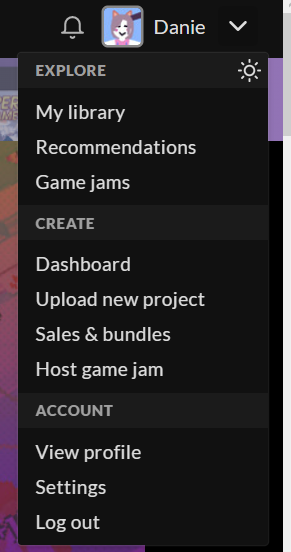
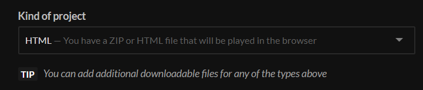
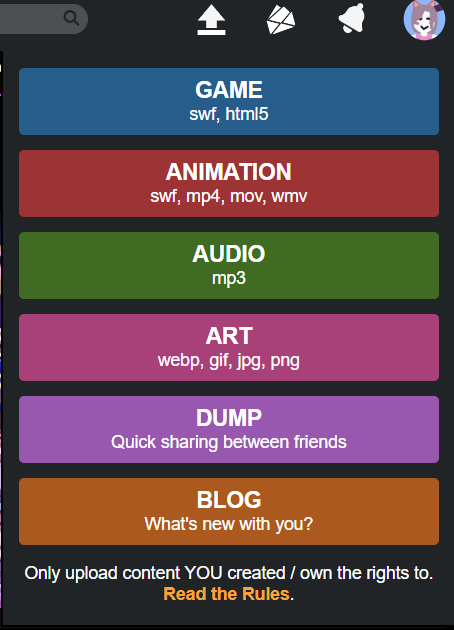

# Publishing a Kaboom game
When we finish our game, the most important time it's here...
Publish it! 

## Preparing the game
We should prepare our game to pubish in the different platforms.

- use relative paths like `sprites/bean.png` or `./sprites/bean.png`
- create a zip with your game, with all assets, code files and a `index.html` as the entry point
- use a custom `canvas` is a good idea too

```js
kaboom({
    canvas: document.queryElement("#myCanvas"),
});
```

## Itch.io
First, go to your account, then **Upload a new project**



Then, in **Kind of project**, you should select **HTML**, so itch.io will let you upload a web game



After that, the only thing left to do is to upload your zip with your game files, or if you have a single `ìndex.html` file
(very tasteful) upload it! 

[**Itch.io Documentation about HTML5 games**](https://itch.io/docs/creators/html5)

## Newgrounds.com
First, go to the up arrow and select Game



Now, as Itch.io, only upload a zip with your fabolous `index.html` game file.

### Tag your game
You can tag your game in the different platforms with the tag `kaboomjs`. Probbably we will see it and even promote in our Twitter :D
