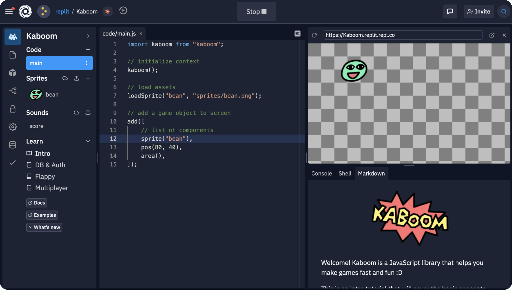

# Setting up Kaboom Development

## Using CDN

Getting the package from a CDN provider is the quickest and easiest way to start using Kaboom.

```html
<script type="module">

// import kaboom lib
import kaboom from "https://unpkg.com/kaboom@next/dist/kaboom.mjs";

// initialize kaboom context
kaboom();

// add a piece of text at position (120, 80)
add([
    text("hello"),
    pos(120, 80),
]);

</script>
```

You can paste this directly in a `.html` file and open with the browser. This will give you the standard fullscreen Kaboom canvas. Feel free to put more HTML in there.

The Kaboom package is deployed to NPM, so it's availbale on various CDN providers, like `unpkg`, `skypack`, `jsdelivr`, etc.

The example above is using Kaboom with es6 module, you can also just include it with a `<script>` tag

```html
<script src="https://unpkg.com/kaboom@next/dist/kaboom.js"></script>
```

## Using NPM

With NPM it's easier have some other packages and do version control, also it's easier to get typescript autocomplete support and stuff, but it requires a bit more setup.

```sh
$ npm install kaboom@next
```

but you'll need to use a bundler to use Kaboom with NPM. There's a lot of options like `esbuild`, `webpack`, `parcel`, `vite`, etc, here I'll give a short example of how to use Kaboom with [`esbuild`](https://esbuild.github.io/).

Once you have `esbuild` installed, and you have this in a `.js` or `.ts` file:

```js
import kaboom from "kaboom";

kaboom();

add([
    text("hello"),
    pos(120, 80),
]);
```

just run

```sh
$ esbuild game.js --bundle > build.js
```

and it'll find the Kaboom package and include it in the built `build.js`, include `build.js` in your HTML and you're good to go. Feel free to automate this process.

## Loading Assets

You might have encountered errors when trying to `loadSprite()` from local file system, that is because browser won't allow loading local files with JavaScript. To get around that you'll need to use a static file that serves the files through HTTP. There're a lot of programs that helps you to do that.

- `$ python3 -m http.server` if you have [python3](https://www.python.org) installed
- `$ python -m SimpleHTTPServer` if you have [python2](https://www.python.org) installed
- `$ serve` if you have [serve](https://github.com/vercel/serve) installed
- `$ caddy file-server` if you have [caddy](https://caddyserver.com/) installed
- `$ static-here` if you have [static-here](https://github.com/amasad/static-here) installed

Let's say you have a folder structure like this:
```sh
.
├── sprites
│   ├── froggy.png
│   └── cloud.png
├── sounds
│   └── horse.png
└── index.html
```

and you have the static file server running on port `8000`, just go to `http://localhost:8000/index.html`, and you should be able to load stuff from relative paths like
```js
loadSprite("froggy", "sprites/froggy.png");
laodSound("horse", "sounds/horse.mp3");
```

To learn more check out this [MDN doc](https://developer.mozilla.org/en-US/docs/Learn/Common_questions/set_up_a_local_testing_server).

## Using Replit

Replit has templates that gets rid of manual setup. Fork from either of these 2 templates:

### [Official Template](https://replit.com/@replit/Kaboom)

This is a complete package including
- In-editor tutorial
- NPM / typescript support
- Autocomplete
- Assets Library
- Replit DB & Auth integration



### [Lighter Template](https://replit.com/@replit/Kaboom-light)

A lighter version that only contains the barebone HTML and JS file.

Cool! Now you should be all ready to start using Kaboom. Try this [intro tutorial](/doc/intro.md) if you don't know how to start.
