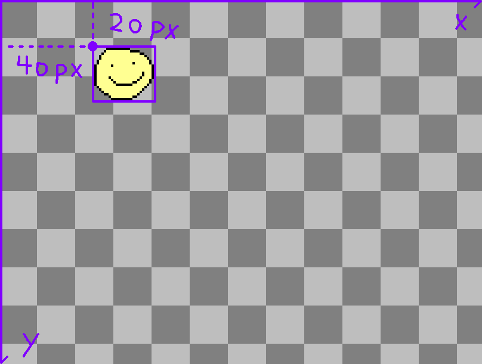

### Welcome to kaboom!

This is a place where you can make games, with JavaScript and [Kaboom.js](https://kaboomjs.com/).

This is an intro tutorial that will cover basic concepts of kaboom and make a very simple chrome dinosaur-like game.

(scroll to the end to see the full code if that's what you're looking for)

You might already noticed you have this piece of code in the editor:

```js
add([
	sprite("mark"),
]);
```

Run it, and hopefully you'll see a [mark](https://replit.com/mark) in the game view!

Before explaining how this piece of code works, let's try adding something and see what happens (hover over the top left of code snippet to copy):

```js
add([
	sprite("mark"),
	pos(40, 20),
]);
```

> tip: you can use the refresh button on the top left corner of the viewport to see changes, it should be faster

Congrats! You should now have a [mark](https://replit.com/mark) at position x: 40 y: 20

So how does this piece of code work? `add()` is the function to add anything to you game, it could be your player character, a bullet, background image, text, anything.

This function takes 1 argument, which is a list of (an array of) components that describes the game object. Each game object is composed from various different components, in this case, we have a game object that consists of 2 components: `sprite("mark")` and `pos(40, 20)`, translating to english would be:

- our game object **has** `sprite`, the sprite name is `"mark"`
- our game object **has** a `pos` (position) on screen, that position is `(40, 20)`



> Later on you might find this way of "composing" game objects really handy, especially when you're adding custom behaviors to your own game mechanics.

Let's try some more built-in components:

```js
add([
	sprite("mark"),
	pos(40, 20),
	area(),
	body(),
]);
```

Here's `area()` and `body()` component, which means
- out game object **has** an `area`, which can respond to collisions (try pressing `F1` to inspect object areas!)
- our game object **has** a `body`, it will respond to physics and fall due to gravity

Run the game and see what happens! Yep, we're falling.

It's not good to let our player keep falling into oblivion, let's add another game object to act as a floor:

```js
add([
	rect(width(), 12),
	pos(0, height() - 12),
	area(),
	solid(),
]);
```

There's 2 new components here:

- `rect(w, h)` our game object has a rectangle look, here we give it a width of `width()` which returns the width of the canvas, and a height of `12`
- `solid()` our game object is a solid object that responds to physics, so other objects may not pass through

`pos()` will be the position of the top left corner of the rectangle, to make it fill the bottom of the screen we make its `x: 0` and `y: height() - 12` (screen height minus the rectangle height)

It might not be that obvious but now we should have a white bar on the bottom of the screen that prevents us from falling further.

Now let's add some interactions!

Kaboom have lots of ways to listen to user input, one is `keyPress()`, which registers an event to fire when a user presses a certain key:

```js
keyPress("space", () => {
	debug.log("ohhi");
	burp();
});
```

paste this piece into your code and see what happens when you press space.

Yep! The function you passed is totally getting executed when you press space!

- `debug.log()` is a function to log message on the screen
- `burp()` makes a burp sound, which we all know is an essential functionality for a game engine to provide

So, how do we make something interactive with the player? First we have to get a handle of the game object reference, which is returned by `add()`

```js
const player = add([
	sprite("mark"),
	pos(40, 20),
	area(),
	body(),
]);
```

As we said before, game objects are composed from components, each component will provide the game object some behavior and properties, in reality each component will give the game object reference some functions that we can use, for example, `body()` components gives our game object the ability to `jump()`.

```js
keyPress("space", () => {
	debug.log("look mom im jumping");
	burp();
	player.jump();
});
```

For reference, the code we have now should look like this:

```js
// add the player character
const player = add([
	sprite("mark"), // it has a sprite look
	pos(40, 20), // it has a position on screen
	area(), // it has an area
	body(), // it has a physical body
]);

// add the floor
add([
	rect(width(), 12), // it has a rectangular look
	pos(0, height() - 12), // it has a position
	area(), // it has an area
	solid(), // it has a solid body
]);

// listen to user key press
keyPress("space", () => {
	debug.log("mom look im jumping"); // log stuff to screen
	burp(); // burp
	// feel free to remove above 2 lines if they're annoying
	player.jump(); // make player jump
});
```

> tip: you can use debug.clearLog() to clear logs, or press `F2`! (if you have "Debug" enabled in settings, which is expanded from the top ">" next to "Kaboom" on the top of the sidebar)

> tip: since we're talking about debug stuff, try pressing `F1` and `F7` - `F10`

There's another function provided by `body()` we can uses here:

```js
// only jump if player is grounded
if (player.grounded()) {
	player.jump(320); // can choose to give it a jump force
}
```

`grounded()` checks if player is currently grounded or not, if player can jump infinitely they'll go out of control

we also specified a jump force for `jump()` here, which will be 320 pixels per second on the initial burst.

Now let's add something for the player to jump over!

```js
add([
	rect(12, rand(12, 32)),
	pos(width(), height() - FLOOR_HEIGHT),
	area(),
	color(0.5, 0.5, 1), // has a blue-ish color
	origin("botleft"), // set the render origin point to bottome left
	"tree", // strings are tags!
]);

action("tree", (tree) => {
	tree.move(-120, 0);
});
```

Some new stuff here:

- `color()` sets the color of the render, it uses rgba and bound to 0.0 - 1.0 (so 0, 0, 1 is blue, 1, 1, 1 is white)
- `origin()` sets the render origin point (the default is top left, see the coordinate image above)
- `"tree"` all strings passed to the list are tags, which we can use to define group actions

`action()` is a really important function to know! It passes some code to kaboom to run every frame (they'll be run every 0.016 second, hopefully). Video games are all about real time interations, we'll have a lot of these.

In this case, we pass the tag `"tree"` as the first argument, telling that this will be an action for all objects with tag `"tree"` (we'll have a lot of them!). In the callback, we get the tree object from the callback argument, and call `.move()` on them, which is a method provided by `pos()` component, what it does is move the game object by a certain speed, in pixels per second.

> Alternatively you can choose to assign the `pos` field directly (which is also provided by the `pos()` component) like `player.pos = vec2(100, 100)` (`vec2()` constructs a 2 dimentional vector which is used to represent position in kaboom)

But it'll do us no good if it doesn't do anything when it hits the player! We need some way to detech if the tree collides with the player, and respond to it. Thankfully it's really easy to do in kaboom:

```js
player.collides("tree", () => {
	debug.log("oops");
});
```

We have an amazing function called `collides()` provided by the `area()` component, which receives 2 arguments, the first one is the tag group to check with, the second one is the action to take when the collision happens. So this piece of code means, everytime our `player` collides with an object with tag `"tree"`, we `debug.log()` something.

The final full code of our game:

```js
const FLOOR_HEIGHT = 12;
const TREE_SPEED = 120;

// add the player character
const player = add([
	sprite("mark"), // it renders as the sprite "mark"
	pos(40, 20), // it has a position on screen
	area(), // it has an area
	body(), // it has a physical body
]);

// add the floor
add([
	rect(width(), FLOOR_HEIGHT), // it has a rectangular look
	pos(0, height() - FLOOR_HEIGHT), // it has a position
	area(), // it has an area
	solid(), // it has a solid body
]);

// listen to user key press
keyPress("space", () => {
	if (gameIsOver) {
		reset();
	} else {
		if (player.grounded()) {
			player.jump(320); // can choose to give it a jump force
		}
	}
});

let gameIsOver = false;
let gameOverText = null;
let score = 0;

// text to display our scores
const scoreText = add([
	text(score),
	pos(12, 12),
]);

// increment score every frame
action(() => {
	if (!gameIsOver) {
		score += 1;
		scoreText.text = score;
	}
});

// reset the game to initial state
function reset() {
	score = 0;
	gameIsOver = false;
	player.paused = false;
	destroyAll("tree");
	destroy(gameOverText);
}

// enter game over state
function gameOver() {
	gameIsOver = true;
	player.paused = true;
	every("tree", (tree) => {
		tree.paused = true;
	});
	gameOverText = add([
		origin("center"),
		pos(center()),
		text("Game Over", 32),
	]);
}

// if player collides with an object with tag "tree", game over!
player.collides("tree", () => {
	gameOver();
});

// every "tree" will move left, and get destroyed when it's out of screen
action("tree", (tree) => {
	tree.move(-TREE_SPEED, 0);
	if (tree.pos.x < -120) {
		destroy(tree);
	}
});

// spawn a tree every rand(0.5, 2) seconds
function spawnTree() {

	if (!gameIsOver) {
		add([
			rect(12, rand(12, 32)),
			area(), // it has an area
			color(0.5, 0.5, 1),
			pos(width(), height() - FLOOR_HEIGHT),
			origin("botleft"),
			"tree",
		]);
	}

	wait(rand(0.5, 2), spawnTree);

}

spawnTree();
```
