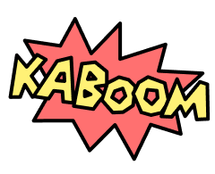
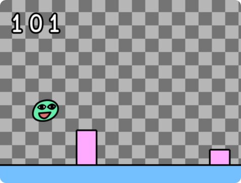
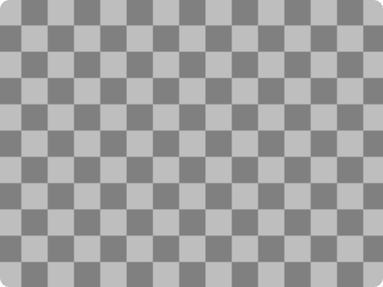
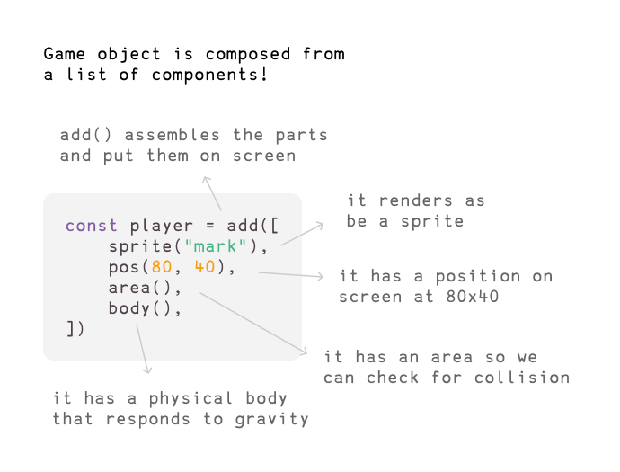
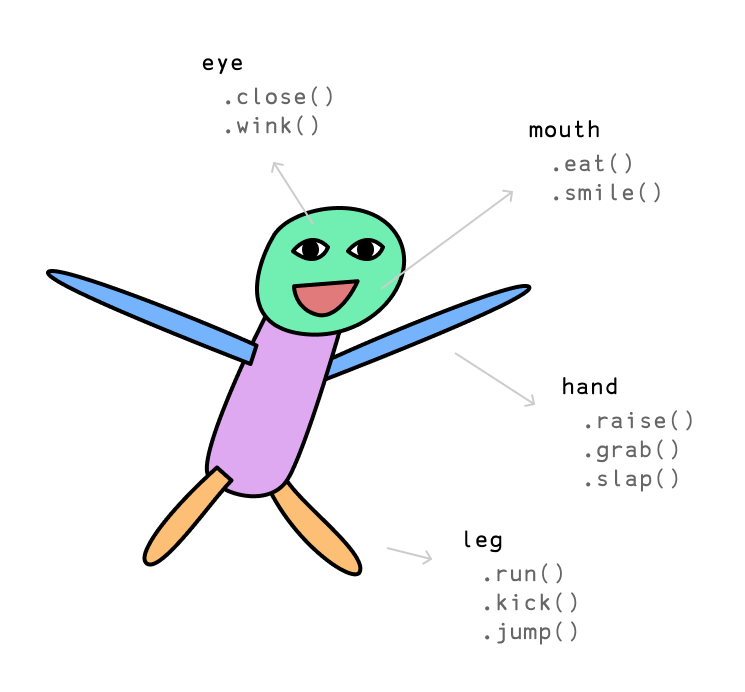
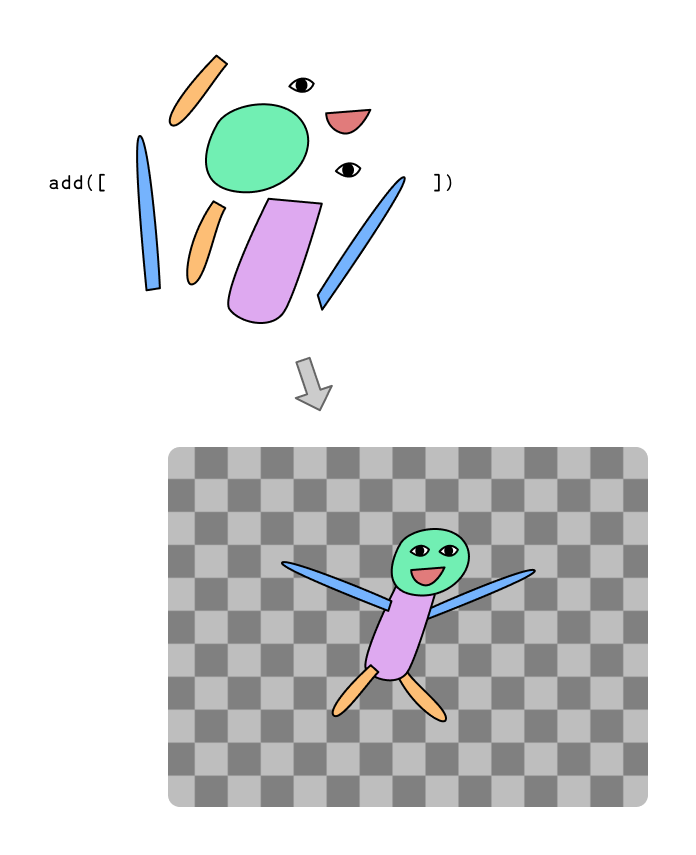

Welcome! Kaboom is a JavaScript library that helps you make games fast and fun :D

This is an intro tutorial that will cover the basic concepts and make a very simple [Chrome Dino](https://en.wikipedia.org/wiki/Dinosaur_Game) - ish game.



(scroll to bottom to see / copy the full game code)

Let's start by initializing the context with the `kaboom()` function.

```js
kaboom()
```

This should give you a blank canvas with a nice checkerboard pattern like this



Then let's add some stuff to screen, like an image.

```js
// load a sprite "bean" from an image
loadSprite("bean", "sprites/bean.png")

// add it to screen
add([
    sprite("bean"),
    pos(80, 40),
])
```

Go ahead and just paste this code and run it, you should see a yellow smily face on screen!

Before explaining what this does, let's try adding some more stuff to it and see what happens:

```js
// add it to screen
add([
    sprite("bean"),
    pos(80, 40),
    scale(3),
    area(),
])

// turns on inspect mode
debug.inspect = true
```

Kaboom uses a component system to describe our game objects (a game object is basically any item you see on screen, like the player character, a bullet, a rock).



If you're having trouble understanding, consider this standard human bean:



Human are also composed from a list of components, each component provides different functionalities, which is exactly what component means in Kaboom. `add()` is the function you use to assemble all the components into a game object in kaboom:



In kaboom different components provides different functionalities (properties, methods), for example, if you add a `body()` component, which makes the user respond to gravity, it also provides methods like `jump()`. Try this code:

```js
import kaboom from "kaboom";

const FLOOR_HEIGHT = 48;
const JUMP_FORCE = 800;
const SPEED = 480;

// initialize context
kaboom();

// load assets
loadSprite("bean", "sprites/bean.png");

scene("game", () => {

	// define gravity
	gravity(2400);

	// add a game object to screen
	const player = add([
		// list of components
		sprite("bean"),
		pos(80, 40),
		area(),
		body(),
	]);

	// floor
	add([
		rect(width(), FLOOR_HEIGHT),
		outline(4),
		pos(0, height()),
		origin("botleft"),
		area(),
		solid(),
		color(127, 200, 255),
	]);

	function jump() {
		if (player.grounded()) {
			player.jump(JUMP_FORCE);
		}
	}

	// jump when user press space
	keyPress("space", jump);
	mouseClick(jump);

	function spawnTree() {

		// add tree obj
		add([
			rect(48, rand(32, 96)),
			area(),
			outline(4),
			pos(width(), height() - FLOOR_HEIGHT),
			origin("botleft"),
			color(255, 180, 255),
			move(LEFT, SPEED),
			"tree",
		]);

		// wait a random amount of time to spawn next tree
		wait(rand(0.5, 1.5), spawnTree);

	}

	// start spawning trees
	spawnTree();

	// lose if player collides with any game obj with tag "tree"
	player.collides("tree", () => {
		// go to "lose" scene and pass the score
		go("lose", score);
		burp();
		addKaboom(player.pos);
	});

	// keep track of score
	let score = 0;

	const scoreLabel = add([
		text(score),
		pos(24, 24),
	]);

	// increment score every frame
	action(() => {
		score++;
		scoreLabel.text = score;
	});

});

scene("lose", (score) => {

	add([
		sprite("bean"),
		pos(width() / 2, height() / 2 - 80),
		scale(2),
		origin("center"),
	]);

	// display score
	add([
		text(score),
		pos(width() / 2, height() / 2 + 80),
		scale(2),
		origin("center"),
	]);

	// go back to game with space is pressed
	keyPress("space", () => go("game"));
	mouseClick(() => go("game"));

});

go("game");
```
