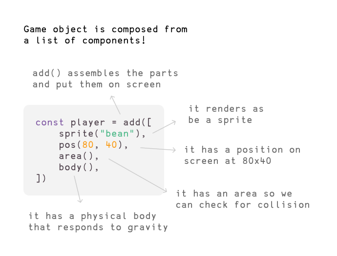
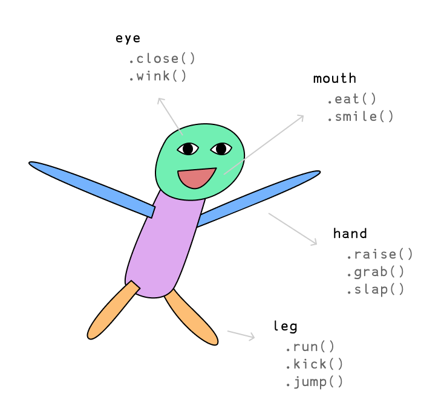

# Intro to Kaboom

Welcome! Kaboom is a JavaScript library that helps you make games fast and fun :D

This is an intro tutorial that will cover the basic concepts and make a very simple [Chrome Dino](https://en.wikipedia.org/wiki/Dinosaur_Game) - ish game.

Let's start by initializing the context with the `kaboom()` function.

```js
kaboom()
```

This should give you a blank 640x480 canvas with a nice checkerboard pattern like this


Then let's add some stuff to screen, like an image.

```js
// load a default sprite "mark"
loadMark()

// add it to screen
add([
    sprite("mark"),
    pos(80, 40),
])
```

Go ahead and just paste this code and run it, you should see a yellow smily face on screen!

Before explaining what this does, let's try adding some more stuff to it and see what happens:

```js
// add it to screen
add([
    sprite("mark"),
    pos(80, 40),
    scale(3),
    area(),
])

// turns on inspect mode
debug.inspect = true
```

Kaboom uses a component system to describe our game objects (a game object is basically any item you see on screen, like the player character, a bullet, a rock).



If you're having trouble understanding, consider this standard human bean:



Human are also composed from a list of components, each component provides different functionalities, which is exactly what component means in Kaboom. `add()` is the function you use to assemble all the components into a game object in kaboom:


In kaboom different components provides different functionalities (properties, methods), for example, if you add a `body()` component, which makes the user respond to gravity, it also provides methods like `jump()`. Try this code: 

```js
add([
    sprite("mark"),
    pos(80, 40),
    scale(3),
    area(),
])
```